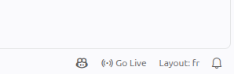
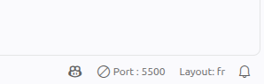
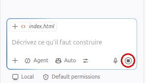
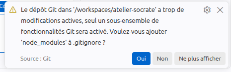
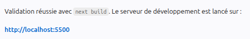

# Atelier Cours Socrate — Créez votre site web ce soir avec l'IA

Bienvenue ! Ce dépôt est votre point de départ pour l'atelier.

---

### 19h00 — Accueil `20 min`

5 min : Branchement, connexion wifi, connexion à github.com dans le navigateur.

Cet atelier se déroule en binôme. On fait le travail sur sa machine propre, mais on échange avec son binôme sur : ses questionnements, ses incompréhensions.

Lorsque je m'installe, je m'installe donc à côté d'une personne qui deviendra donc mon binôme :) .

Si nombre impair de participants : 1 trinôme aura lieu.

5 min : présentation Professeur

10 min : Tour de table de la salle : « votre prénom + ce que vous aimeriez mettre sur un site, ce que vous recherchez dans cet évènement ».

**Les 3 règles de l'atelier :**

1. Ordre lorsque je me pose une question : je demande d'abord à l'IA, puis à mon binôme, puis au professeur.
2. On ne reste jamais bloqué plus de 5 minutes — on lève la main.
3. L'informatique peut planter — on suit avec son binôme.

---

### 19h20 — Ouverture des environnements `10 min`

Depuis ce dépôt modèle, chacun crée son espace de travail dans le navigateur.
Le binôme dont l'environnement est ouvert aide l'autre.
Les comptes non vérifiés passent en binôme sur une machine.

**Étape 1 — Copiez ce modèle chez vous**

Cliquez sur le bouton vert **« Use this template »** (en haut à droite de cette page),
puis **« Create a new repository »**.

- **Repository name** : `mon-site` (ou le nom que vous voulez, sans espaces ni accents)
- Laissez tout le reste tel quel, puis cliquez sur **« Create repository »**.

Vous venez de créer votre premier _dépôt_ : le dossier qui contiendra votre site.

**Étape 2 — Ouvrez votre atelier de travail**

Sur la page de **votre** nouveau dépôt :

1. Cliquez sur le bouton vert **« Code »**
2. Ouvrez l'onglet **« Codespaces »**
3. Cliquez sur **« Create codespace on main »**

L'ouverture de l'atelier de travail (Codespace) peut prendre jusqu'à dix minutes. Pourquoi c'est si long ?
Pour cet atelier découverte nous avons décidé de vous faciliter la tâche en ne vous faisant rien installer sur votre ordinateur. Alors nous utilisons les "Codespaces" Github qui sont de petits ordinateurs que Github ouvre pour vous gratuitement et sur lesquels tout est installé pour coder. Ces dix minutes permettent donc en fait à GitHub de démarrer une vraie machine à votre nom, et d'installer des logiciels d'édition de code dessus (VSCode) pour que vous puissiez coder. C'est sur cette machine (Ce Codespace qui s'ouvre sur un onglet de votre navigateur) que vous allez coder et exposer votre site.

Si vous décidez de suivre le cours (cours-socrate.ai) on installera l'éditeur de code sur votre machine. Ca restera gratuit, mais ce sera au final beaucoup plus rapide ! Lorsque vous voudrez coder vous aurez juste à ouvrir VSCode !

---

### 19h30 — Théorie — démystification `10 min`

Comment marche un LLM, en français sans maths (7 min).
Pourquoi « l'IA code » ne veut pas dire « plus besoin de comprendre ».
Les rêgles du pilote (4 min).

---

### 19h40 — Le site naît sous vos yeux `10 min`

**Votre environnement de travail — repérez les 4 zones :**


Votre écran ressemble à un atelier avec 4 zones distinctes :

1. **La colonne de gauche — l'Explorateur** : c'est le sommaire de votre projet. Vous y voyez vos fichiers : `index.html` (une page de test), `README.md` (ce que vous lisez en ce moment), et des dossiers comme `.claude` ou `.devcontainer`. Après le prompt, l'IA créera de nouveaux fichiers et dossiers ici — c'est normal. Pour ouvrir un fichier, cliquez dessus.

2. **La zone centrale — l'Éditeur** : c'est ici que s'affiche le contenu du fichier que vous avez cliqué. En haut, des onglets permettent de passer d'un fichier à l'autre. Vous voyez du code avec des numéros de lignes à gauche et des couleurs différentes — c'est normal, les couleurs aident à lire le code.

3. **Le panneau du bas — le Terminal** : c'est une ligne de commande, comme une conversation texte avec votre machine. Vous pourrez aussi y taper des commandes vous-même quand vous serez plus avancé en code; pour ce soir, on n'y touchera pas.

4. **Le panneau de droite — le Chat IA** : c'est ici que vous parlez à l'IA. Vous tapez votre demande dans le champ « Décrivez ce qu'il faut construire » en bas, puis vous appuyez sur Entrée. L'IA va alors modifier vos fichiers et vous expliquer ce qu'elle fait.

Pour cet atelier, on utilise comme "harnais IA" (voir la définition de harnais IA dans la FAQ en bas de ce fichier): _Github Copilot_ en mode "Auto", c'est à dire que Copilot va choisir lui-même quelle IA il va utiliser par rapport à la requête que vous lui faites. Il peut par exemple choisir GPT 5-6 Terra, ou Claude Sonnet 5.

Si vous suivez le cours Cours-Socrate.ai avec nous par la suite, nous utiliserons comme "harnais IA" : _Claude Code_ avec un forfait pro. Ensuite comme IA, nous utiliserons par exemple Claude Opus 4.6 ou Claude Opus 5.

En bas de l'écran, la **barre d'état** affiche des informations utiles : la branche `main`, le type de fichier, et le bouton **« Go Live »** qu'on utilisera juste pour un premier test rapide (voir FAQ pour les détails).

**Étape 1 — Vérifiez que tout marche**

1. Dans la colonne de gauche, cliquez sur le fichier **`index.html`**
2. En bas à droite de l'écran, cliquez sur **« Go Live »**

   

3. Un nouvel onglet s'ouvre : vous devez voir la page **« Bonjour, je m'appelle \_\_\_ »**

✅ Vous voyez la page ? Parfait, vous êtes prêt·e !

Refermez-là, et refermez le port 5500 (voir ce qu'est un port dans la FAQ) en revenant sur le codespace et en cliquant sur "Port 5500" ici :



**Étape 2 — A vous de jouer !**

Le binôme lance le prompt commun (ci-dessous) sur la machine A et lit ensemble ce qui sort — fichiers créés, textes proposés ; échanges dans le binôme : « quels fichiers ont été créés ? ». Puis machine B.
Premier réflexe : regarder l'agent travailler, pas seulement le résultat.

_Trois petites choses à savoir avant de commencer :_

1. **Activer l'approbation automatique** — Lorsque l'IA travaille, elle peut avoir besoin d'exécuter des commandes ordinateur pour lesquelles elle vous demande normalement des autorisations, une à une. C'est vite rébarbatif quand elle va se mettre à passer dix, vingt, trente commanders.Pour activer l'approbation automatique, cliquez en bas du chat sur **« Default permissions »** et choisissez **« Allow all »**.

2. **Accepter l'IA** — La première fois que vous lancez un prompt, une fenêtre peut vous demander si vous acceptez d'utiliser l'IA. Répondez **oui**.

3. **Savoir si l'IA travaille encore** — Regardez le petit bouton en bas à droite de la fenêtre d'entrée de prompt :
   - Un **carré** signifie que l'IA est encore en train de travailler (ou attend votre autorisation, cf. point 2).
     
   - Une **petite flèche** (comme au départ) signifie que l'IA a terminé et attend votre prochain message.
     

4. **Ne plus afficher Avertissement "Le dépôt Git ..."** -
   Environ vers la fin du travail de Copilot, le codespace, voyant que beaucoup de fichiers ont changé, va vous demander ce que vous voulez en faire d'un point de vue de Git. Il est trop rapide, nous voyons ce point un peu plus tard dans l'atelier. Pour le moment, ignorez cet avertissement en cliquand sur "Ne plus afficher".



_Prompt commun_

- Enregistrez votre profil LinkedIn en PDF : sur votre page LinkedIn, dans la section introduction, cliquez sur « Ressources », puis « Save to PDF ».
- Copiez le PDF dans votre Codespace : faites un glisser-déposer du PDF dans la zone « Explorateur » (colonne de gauche) de votre Codespace.
- Copiez le bloc ci-dessous, collez-le dans le chat du Codespace, puis tapez « Entrée ».

```
/frontend-design Créé un site web multipages sur moi avec nextjs, react, tailwind.  Utilise les informations Profile.pdf. A la fin, lance le site en mode dev sur localhost:5500 .
```

_Comprendre votre prompt :_

- /frontend-design permet de charger le skill frontend-design (dans le dossier .agents de votre dépot). Ce skill permet d'améliorer la façon dont votre IA va travailler pour effectuer votre site. Allez dans le fichier pour comprendre ce qui est dit à l'IA pour améliorer le site.
- nextjs, react, tailwind sont des librairies de code (à la pointe en 2026) pour créer tout type de code. Avec ça, vous êtes parfaitement armés pour créer par la suite n'importe quel type de site !
- localhost:5500 est l'adresse (localhost, votre serveur codespace) et le port (5500, la porte d'entrée) où l'on pourra voir votre site. Voir la FAQ : localhost et port 5500 plus bas.

_Ouvrir votre site lorsque l'IA a fini de travailler:_

- A la fin de ce premier prompt, l'IA devrait vous donner quelque chose comme la copie d'écran suivant :
  
  C'est tout bon ! Votre site tourne sur le codespace, vous pouvez l'ouvrir en cliquant sur le lien en bleu qu'elle vous a donné localhost:5500

---

### 19h50 — Personnalisation `10 min`

Chacun sur son site : 2–3 demandes à l'IA à partir des prompts d'exemple ci-dessous, puis libre.

À chaque changement, se poser la question : « ce changement, il a touché quel fichier ? ».

Lorsque les fichiers ont été modifiés, allez sur l'onglet de votre page pour voir les modifications (N'oubliez pas de recharger votre page (F5)!)

**Important :** si vous avez fermé l'onglet avec votre site, pour le réouvrir, n'hésitez pas à demander à l'IA: "Si mon site est déjà lancé en mode dev sur localhost:5500, réouvre cette page; sinon lance mon site en mode dev sur localhost:5500".

**Exemples de prompts :**

```
Remplace les textes inventés par ceux-ci : …
```

```
Passe toute la palette en [couleur] et ses nuances, garde le même agencement
```

```
Rends le titre d'ouverture deux fois plus grand et ajoute une phrase d'accroche en dessous
```

```
Ajoute une section avec trois cartes côte à côte, qui se réorganisent en colonne sur téléphone
```

---

### 20h00 — Pause `5 min`

---

### 20h05 — Pousser son code sur GitHub `9 min`

Demander à l'IA : « pousse mon code sur GitHub ».
Allez voir sur le site Github.com son code enregistré.

---

### 20h14 — Transition `1 min`

« Maintenant, l'IA se tait — c'est vous qui codez ».

---

### 20h15 — Les mains dans le code `15 min`

- **5 min** — Modifier soi-même un texte et une couleur dans le fichier.
- **7 min** — La casse : supprimer « quelque chose qui a l'air important », constater le dégât.
  Demander à l'IA de réparer.. L'IA va alors décider d'aller récupérer notre code sur notre dépôt Github. D'où l'intérêt d'avoir sauvegardé notre site sur Github !
- **3 min** — Débrief : « le code n'est pas magique, il est lisible ».

---

### 20h30 — Grand final `13 min`

Rendre le site visible publiquement (pas-à-pas au projecteur).
2 possibilités pour voir le site sur son téléphone :

- Demander à l'IA « génère un QR code qui pointe vers mon site ».
- S'envoyer un mail avec l'adresse.

Chacun ouvre son site sur son téléphone, l'envoie à un proche, photo de groupe.

---

### 20h43 — Questions libres et Présentation cours `12 min`

Reconversion, temps nécessaire, matériel, âge, maths.
Présentation du cours : programme du trimestre, 28 septembre, même salle.

---

### 20h55 — Clôture `5 min`

Flyer sur table, lien cours-socrate.ai au projecteur, rappel de la prochaine date d'atelier.
Merci à tous !.

---

### FAQ

**Quelle est la différence entre une IA, un modèle IA et un harnais IA ?**

- **Un modèle IA** (ex. GPT 6-Astra, Claude Fable 5.1, Gemini 3.8 Flash) est le « cerveau » : un programme entraîné sur d'immenses quantités de texte, capable de comprendre et de générer du langage. Il ne sait rien faire d'autre que recevoir du texte et en produire.
- **Un harnais IA** (ex. GitHub Copilot, Claude Code, Cursor) est l'outil qui entoure le modèle : il lui donne accès à vos fichiers, lui permet d'exécuter des commandes, affiche ses réponses dans une interface, gère les autorisations… C'est le « cockpit » qui rend le modèle utile dans un contexte concret. Un même modèle peut être utilisé par plusieurs harnais différents.
- **L'IA** est le terme générique qui englobe tout cela. Quand on dit « l'IA a modifié mon fichier », c'est en réalité le harnais qui a demandé au modèle quoi écrire, puis qui a appliqué le changement.

**Analogie** : le modèle, c'est le moteur d'une voiture. Le harnais, c'est la voiture complète (volant, pédales, tableau de bord). « L'IA », c'est quand on dit « la voiture » sans préciser.

**C'est quoi `localhost` ?**

Quand vous tapez une adresse comme `google.com` dans votre navigateur, vous demandez à voir un site hébergé sur un ordinateur distant (un _serveur_). `localhost`, c'est l'adresse spéciale qui dit au navigateur : « ne va pas chercher ailleurs, regarde sur **cette machine-ci** ». C'est votre propre ordinateur (ou, dans notre cas, votre Codespace) qui joue le rôle du serveur.

Quand l'IA lance votre site « en mode dev sur localhost », elle démarre un petit serveur directement dans votre Codespace. Le site tourne sur cette machine, pas sur un hébergeur classique — mais comme GitHub Codespaces rend le port accessible via une URL (du type `*.app.github.dev`), vous pouvez quand même y accéder depuis votre navigateur, et même partager ce lien temporairement. Ce n'est pas un « vrai » hébergement : dès que le Codespace s'éteint (après 30 min d'inactivité), le site disparaît.

**C'est quoi un port (le `:5500` dans `localhost:5500`) ?**

Imaginez un immeuble : `localhost` est l'adresse de l'immeuble, et le **port** est le numéro de l'appartement. Un même ordinateur peut faire tourner plusieurs services en même temps (un site web, un serveur de base de données, etc.), et chacun écoute sur un port différent pour ne pas se mélanger.

Dans notre atelier, on utilise le port **5500**. C'est pour cela que l'adresse complète est `localhost:5500` : « sur cette machine, appartement 5500 ».

**C'est quoi le bouton « Go Live » ?**

« Go Live » est un bouton fourni par l'extension _Live Server_ de VSCode. Il démarre un mini-serveur qui **affiche des fichiers HTML statiques** dans le navigateur. On l'utilise uniquement au début de l'atelier pour vérifier que le Codespace fonctionne (étape 1, avec le fichier `index.html` du modèle).

Une fois que l'IA a créé votre vrai site (un projet Next.js / React), « Go Live » ne sert plus à rien — c'est le **serveur de développement** de Next.js (lancé automatiquement par l'IA via la commande `npm run dev` dans le terminal) qui prend le relais. Le résultat est le même pour vous : un onglet s'ouvre avec votre site sur `localhost:5500`.

**Mon site ne s'affiche pas, que faire ?**

- **Au test initial (étape 1 de 19h40)** : vérifiez que le fichier `index.html` est bien ouvert dans l'éditeur (onglet actif) avant de cliquer sur « Go Live ». Si un nouvel onglet s'ouvre mais reste blanc, attendez quelques secondes.
- **Après le prompt (votre vrai site Next.js)** : demander à l'IA: "Si mon site est déjà lancé en mode dev sur localhost:5500, réouvre cette page; sinon lance mon site en mode dev sur localhost:5500"

**C'est quoi Git et GitHub ?**

**Git** est un outil qui enregistre l'historique de vos fichiers, un peu comme un « Ctrl+Z géant » pour tout un projet. Chaque fois que vous faites une sauvegarde (on appelle ça un _commit_), Git prend une photo de l'état de tous vos fichiers à cet instant. Si quelque chose casse, vous pouvez revenir à n'importe quelle photo précédente.

**GitHub** est un site web qui héberge vos projets Git en ligne. C'est comme un Google Drive pour le code : votre travail est stocké sur Internet, vous pouvez y accéder depuis n'importe quel ordinateur, et vous pouvez le partager avec d'autres.

Dans l'atelier, quand on « pousse le code sur GitHub », on envoie nos photos (commits) locales vers GitHub pour les mettre en sécurité. C'est grâce à ça que l'IA peut récupérer votre code si vous cassez quelque chose — elle va chercher la dernière version sauvegardée sur GitHub.

**Le message « Le dépôt Git… » qui apparaît** : quand l'IA crée beaucoup de fichiers d'un coup, le Codespace détecte les changements et vous propose de les gérer avec Git. On s'en occupe plus tard dans l'atelier — pour l'instant, cliquez sur « Ne plus afficher ».

**Est-ce que l'IA peut tout coder ?**

Elle est très forte pour générer du code standard (une page web, un formulaire, un style CSS). Elle peut se tromper sur des demandes complexes ou ambiguës. C'est pourquoi on apprend à vérifier ce qu'elle produit — c'est tout l'objet du cours !

**Je peux continuer après l'atelier ?**

Oui ! Votre dépôt GitHub reste en ligne avec votre code. Ça c'est à vous, ça ne meurt pas à la fin de l'atelier.

Votre site lui s'éteindra lorsque s'éteindra votre codespace, au bout de 30 minutes d'inactivité.

Vous pouvez rouvrir un Codespace à tout moment depuis votre dépôt, et demander à l'IA de relancer votre site ("lance mon site en mode dev sur localhost:5500")

Et si vous voulez aller plus loin pour avoir un site hébergé qui ne meurt pas au bout de 30 minutes : [cours-socrate.ai](https://cours-socrate.ai).

---

_Cet atelier est proposé par [Cours Socrate](https://cours-socrate.ai) —
cours du soir de programmation et d'IA pour grands débutants, Paris 5ᵉ._
