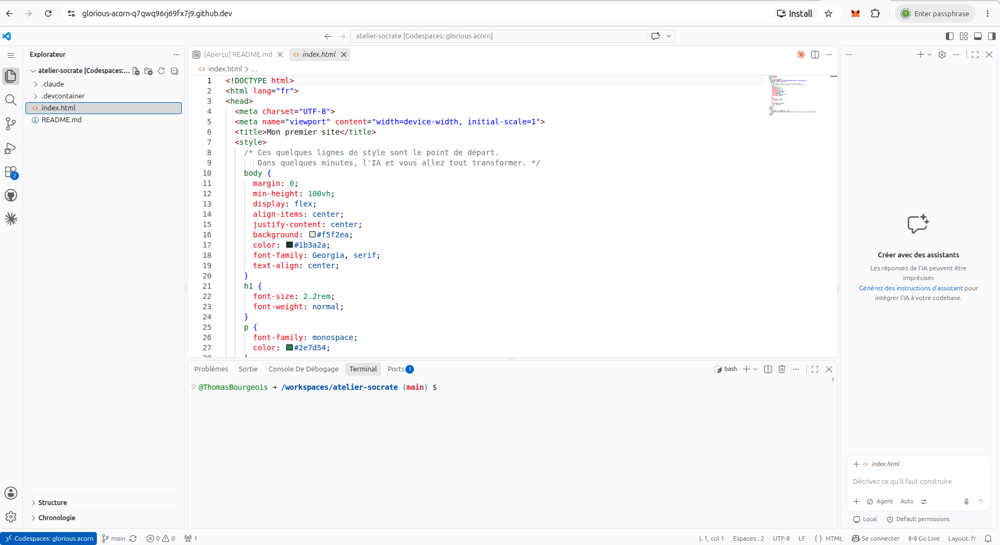
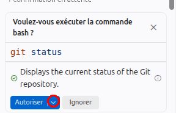
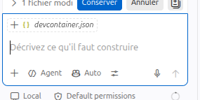

# Atelier Cours Socrate — Créez votre site web ce soir avec l'IA

Bienvenue ! Ce dépôt est votre point de départ pour l'atelier.

---

### 19h00 — Accueil `20 min`

5 min : Branchement, connexion wifi, connexion à github.com dans le navigateur.

Cet atelier se déroule en binôme. On fait le travail sur sa machine propre, mais on échange avec son binôme sur : ses questionnements, ses incompréhensions.

Lorsque je m'installe, je m'installe donc à côté d'une personne qui deviendra donc mon binôme :) .

Si nombre impair de participants : 1 trinôme aura lieu.

5 min : présentation Professeur
10 min : Tour de table de la salle : « votre prénom + ce que vous aimeriez mettre sur un site, ce que vous recherchez dans cet évènement ».

**Les 3 règles de l'atelier :**

1. Ordre lorsque je me pose une question : je demande d'abord à l'IA, puis à mon binôme, puis au professeur.
2. On ne reste jamais bloqué plus de 5 minutes — on lève la main.
3. L'informatique peut planter — on suit avec son binôme.

---

### 19h20 — Ouverture des environnements `10 min`

Depuis ce dépôt modèle, chacun crée son espace de travail dans le navigateur.
Le binôme dont l'environnement est ouvert aide l'autre.
Les comptes non vérifiés passent en binôme sur une machine.

**Étape 1 — Copiez ce modèle chez vous**

Cliquez sur le bouton vert **« Use this template »** (en haut à droite de cette page),
puis **« Create a new repository »**.

- **Repository name** : `mon-site` (ou le nom que vous voulez, sans espaces ni accents)
- Laissez tout le reste tel quel, puis cliquez sur **« Create repository »**.

Vous venez de créer votre premier _dépôt_ : le dossier qui contiendra votre site.

**Étape 2 — Ouvrez votre atelier de travail**

Sur la page de **votre** nouveau dépôt :

1. Cliquez sur le bouton vert **« Code »**
2. Ouvrez l'onglet **« Codespaces »**
3. Cliquez sur **« Create codespace on main »**

L'ouverture de l'atelier de travail (Codespace) peut prendre jusqu'à dix minutes. Pourquoi c'est si long ?
Pour cet atelier découverte nous avons décidé de vous faciliter la tâche en ne vous faisant rien installer sur votre ordinateur. Alors nous utilisons les "Codespaces" Github qui sont de petits ordinateurs que Github ouvre pour vous gratuitement et sur lesquels tout est installé pour coder. Ces dix minutes permettent donc en fait à GitHub de démarrer une vraie machine à votre nom, et d'installer des logiciels d'édition de code dessus (VSCode) pour que vous puissiez coder. C'est sur cette machine (Ce Codespace qui s'ouvre sur un onglet de votre navigateur) que vous allez coder et exposer votre site.

Si vous décidez de suivre le cours (cours-socrate.ai) on installera l'éditeur de code sur votre machine. Ca restera gratuit, mais ce sera au final beaucoup plus rapide ! Lorsque vous voudrez coder vous aurez juste à ouvrir VSCode !

Vous aurez besoin de ce prompt commun de génération :

"Crée un site web d'une seule page, en français, sur [SUJET].
Tout dans index.html (HTML + CSS + le peu de JS nécessaire), aucun fichier externe.
Style : élégant et moderne, façon studio de design.
- Police Google Fonts : un serif marqué pour les titres, un sans-serif pour le texte
- Palette : trois couleurs maximum, dont une dominante et une d'accent
- Une grande section d'ouverture qui remplit l'écran, avec un titre très grand
- Beaucoup d'espace blanc, texte large, alignement soigné
- Aucune image externe : utilise des aplats de couleur et des formes CSS
- Une apparition en fondu des sections au défilement
- Le site doit être lisible sur téléphone

Contenu : une accroche, trois sections avec des textes que tu inventes (je les remplacerai), et un pied de page. Après chaque modification, explique-moi en une phrase ce que tu viens de faire."


---

### 19h30 — Théorie — démystification `11 min`

Comment marche un LLM, en français sans maths (7 min).
Pourquoi « l'IA code » ne veut pas dire « plus besoin de comprendre ».
Les rêgles du pilote (4 min).

---

### 19h41 — Le site naît sous vos yeux `10 min`

**Votre environnement de travail — repérez les 4 zones :**



Votre écran ressemble à un atelier avec 4 zones distinctes :

1. **La colonne de gauche — l'Explorateur** : c'est le sommaire de votre projet. Vous y voyez vos fichiers : `index.html` (le fichier de votre site), `README.md` (ce que vous lisez en ce moment), et des dossiers comme `.claude` ou `.devcontainer`. Pour ouvrir un fichier, cliquez dessus.

2. **La zone centrale — l'Éditeur** : c'est ici que s'affiche le contenu du fichier que vous avez cliqué. En haut, des onglets permettent de passer d'un fichier à l'autre. Vous voyez du code avec des numéros de lignes à gauche et des couleurs différentes — c'est normal, les couleurs aident à lire le code.

3. **Le panneau du bas — le Terminal** : c'est une ligne de commande, comme une conversation texte avec votre machine. Vous pourrez aussi y taper des commandes vous-même quand vous serez plus avancé en code; pour ce soir, on n'y touchera pas.

4. **Le panneau de droite — le Chat IA** : c'est ici que vous parlez à l'IA. Vous tapez votre demande dans le champ « Décrivez ce qu'il faut construire » en bas, puis vous appuyez sur Entrée. L'IA va alors modifier vos fichiers et vous expliquer ce qu'elle fait.

En bas de l'écran, la **barre d'état** affiche des informations utiles : la branche `main`, le type de fichier, et surtout le bouton **« Go Live »** qui sert à afficher votre site dans le navigateur.

**Étape 1 — Vérifiez que tout marche**

1. Dans la colonne de gauche, cliquez sur le fichier **`index.html`**
2. En bas à droite de l'écran, cliquez sur **« Go Live »**
3. Un nouvel onglet s'ouvre : vous devez voir la page **« Bonjour, je m'appelle \_\_\_ »**

✅ Vous voyez la page ? Parfait, vous êtes prêt·e !

**Étape 2 — A vous de jouer !**

Le binôme lance le prompt commun (ci-desssous) sur la machine A et lit ensemble ce qui sort — fichiers créés, textes proposés ; échanges dans le binôme : « quels fichiers ont été créés ? ». Puis machine B.
Premier réflexe : regarder l'agent travailler, pas seulement le résultat.

**Trois petites choses à savoir avant de commencer :**

1. **Accepter l'IA** — La première fois que vous lancez un prompt, une fenêtre peut vous demander si vous acceptez d'utiliser l'IA. Répondez **oui**.

2. **Activer l'approbation automatique** — Lorsque l'IA travaille, elle peut avoir besoin d'exécuter des commandes et vous demande alors votre autorisation via un bouton bleu « Autoriser ». Pour ne pas avoir à cliquer à chaque fois, cliquez sur **la petite flèche à côté du bouton « Autoriser »**, puis sur **« Activer l'approbation automatique »**.

   

3. **Savoir si l'IA travaille encore** — Regardez le petit bouton en bas à droite de la fenêtre d'entrée de prompt :
   - Un **carré** signifie que l'IA est encore en train de travailler (ou attend votre autorisation, cf. point 2).
     
   - Une **petite flèche** (comme au départ) signifie que l'IA a terminé et attend votre prochain message.
     

**Prompt commun** (copie le bloc ci-dessous, copie le dans le chat du Codespace, modifie le "SUJET" à ta guise, puis tape "Entrée") :

```
Crée un site web d'une seule page, en français, sur [SUJET].
Tout dans index.html (HTML + CSS + le peu de JS nécessaire), aucun fichier externe.
Style : élégant et moderne, façon studio de design.
- Police Google Fonts : un serif marqué pour les titres, un sans-serif pour le texte
- Palette : trois couleurs maximum, dont une dominante et une d'accent
- Une grande section d'ouverture qui remplit l'écran, avec un titre très grand
- Beaucoup d'espace blanc, texte large, alignement soigné
- Aucune image externe : utilise des aplats de couleur et des formes CSS
- Une apparition en fondu des sections au défilement
- Le site doit être lisible sur téléphone
Contenu : une accroche, trois sections avec des textes que tu inventes (je les remplacerai), et un pied de page.
Après chaque modification, explique-moi en une phrase ce que tu viens de faire.
```

---

### 19h51 — Personnalisation `10 min`

Chacun sur son site : 2–3 demandes à l'IA à partir des prompts d'exemple ci-dessous, puis libre.
À chaque changement, se poser la question : « ce changement, il a touché quel fichier ? ».

**Exemples de prompts :**

```
Remplace les textes inventés par ceux-ci : …
```

```
Passe toute la palette en [couleur] et ses nuances, garde le même agencement
```

```
Rends le titre d'ouverture deux fois plus grand et ajoute une phrase d'accroche en dessous
```

```
Ajoute une section avec trois cartes côte à côte, qui se réorganisent en colonne sur téléphone
```

---

### 20h01 — Pause `5 min`

---

### 20h06 — Pousser son code sur GitHub `8 min`

Demander à l'IA : « pousse mon code sur GitHub ».
Allez voir sur le site Github.com son code enregistré.

---

### 20h14 — Transition `1 min`

« Maintenant, l'IA se tait — c'est vous qui codez ».

---

### 20h15 — Les mains dans le code `15 min`

- **5 min** — Modifier soi-même un texte et une couleur dans le fichier.
- **7 min** — La casse : supprimer « quelque chose qui a l'air important », constater le dégât.
  Demander à l'IA de réparer.. L'IA va alors décider d'aller récupérer notre code sur notre dépôt Github. D'où l'intérêt d'avoir sauvegardé notre site sur Github !
- **3 min** — Débrief : « le code n'est pas magique, il est lisible ».

---

### 20h30 — Grand final `13 min`

Rendre le site visible publiquement (pas-à-pas au projecteur).
2 possibilités pour voir le site sur son téléphone :

- Demander à l'IA « génère un QR code qui pointe vers mon site ».
- S'envoyer un mail avec l'adresse.

Chacun ouvre son site sur son téléphone, l'envoie à un proche, photo de groupe.

---

### 20h43 — Questions libres et Présentation cours `12 min`

Reconversion, temps nécessaire, matériel, âge, maths.
Présentation du cours en réponse aux questions : programme du trimestre, 28 septembre, même salle.

---

### 20h55 — Clôture `5 min`

Flyer sur table, lien cours-socrate.ai au projecteur, rappel de la prochaine date d'atelier.
Merci à tous !.

---

_Cet atelier est proposé par [Cours Socrate](https://cours-socrate.ai) —
cours du soir de programmation et d'IA pour grands débutants, Paris 5ᵉ._
